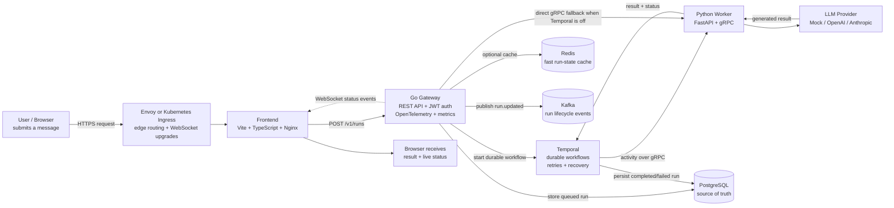

# AgentMesh high-level architecture

This diagram shows what happens when a user submits a message and how the platform’s major technologies work together.

## What each part does

1. The browser sends a message through Envoy or an ingress controller to the frontend.
2. The frontend sends the run request to the Go gateway.
3. The gateway authenticates the request when JWT security is enabled, records telemetry, and creates a queued run.
4. PostgreSQL stores durable run state. Redis can serve repeated reads faster, while Kafka distributes lifecycle events to other consumers.
5. When Temporal is enabled, it owns the durable workflow. It retries the worker activity if a service or network failure occurs.
6. The Python worker calls the selected model provider and returns the generated result over gRPC.
7. Temporal persists the completed or failed state, and the gateway exposes it through REST and WebSockets.
8. The frontend displays the result. If WebSockets are unavailable, it falls back to polling the REST endpoint.

## How the platform runs

- Docker packages the gateway, worker, and frontend into reproducible images.
- Kubernetes schedules and scales those containers, checks their health, and provides service discovery.
- Helm packages the Kubernetes resources with environment-specific values.
- Terraform provisions the AWS foundation, including VPC, EKS, RDS, ElastiCache, and MSK.
- Argo CD watches Git and synchronizes the Helm deployment, correcting drift automatically.
- k6 exercises the public run path to measure throughput, latency, and failures.

## Main request interfaces

- `POST /v1/runs` — create a run.
- `GET /v1/runs/{id}` — retrieve run state.
- `GET /v1/runs/{id}/events` — receive WebSocket status updates.
- `GET /healthz` — service health check.
- `GET /debug/metrics` — gateway request, error, and latency metrics.